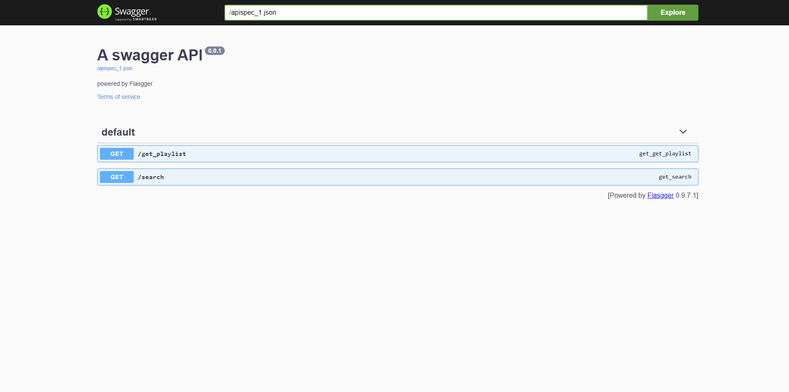

<h1 align="center"><a href="https://guess-the-song-flask.vercel.app/" target="_blank">Swagger Here</a></h1>

<p align="center">
  
</p>

## ℹ️ About

This project is the API of the [GuessTheSong Application](https://github.com/angelomca09/guessthesong-front).

All the data and samples used in the project comes from the [Deezer API](https://developers.deezer.com/).

It is all heavily inspired on [Musicle](https://musicle.app/), so be sure to go check it out!

This project is being hosted in [Cloudflare Pages](https://pages.cloudflare.com/) while its API is being hosted in [Verce](https://vercel.com/)

## ⌨️ Techs

Backend was made using **Flask** as a tool to create and manage the routes and **requests** to get the information from **DEEZER API**. Here are all the techs used:
- Flask
  - flask_cors
  - flasgger
- requests
- Python

> [!NOTE]
>
>To run the project you would probably like to run your local [GuessTheSong Interface](https://github.com/angelomca09/guessthesong-front).

## ⌨️ Running and Building

First Steps

To install and run the backend dependencies you first need python installed and to be at root directory.

```
pip insatall -r requirements.txt
```

Note that to run successfuly, you'll need to create a `.env` file and add the `URL_FRONT` key to it. You may use your local API address.
```
URL_FRONT="http://localhost:5173/*"
```

## 🎶 That's all!
If you like it, consider to leave a ⭐! 